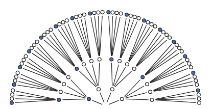
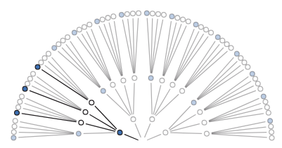
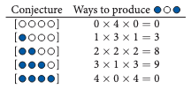

# Small Worlds and Large Worlds

> Bayesian models are created inside of an environment that is controlled by us.

We define the variables and make sure it performs appropriately under the assumptions we also create.

The environment is defined as completely as possible to model the real world.

> When the model is deployed, it is placed outside of this perfect context... thus it will fail at times.

### Section 2.1

> To perform Bayesian inference, a good start is to explore every possible decision we can make and subsequent decisions that follow.

The idea is that as we learn what results actually occur, we begin to "prune" off.

In the forking forest of marbles example, the author illustrates every possible path if we know that the marbles are BWWW, and then we "prune" impossible paths based on the fact that we pulled BWB.

*Note we are saying that after each pull we put the marble back in the bag and can potentially pull it again. The ordering is most important in this example.

The author notes that in 3/64 paths we get the desired BWB sequence.

The idea is that based on the setup of our bag, we can assign probabilities to those scenarios. For example, if we had BBBW, then we would have 9/64 paths being BWB.

Look at this chart and convince yourself how to compute the number of possibilities without drawing the garden.

At each step:
1. how many of the four marbles give me that marble in the sequence

BBBW
1. 3 marbles to get the first B
2. 1 marble to get the one W
3. 3 marbles to get the second B

This gives us 3 x 1 x 3 = 9 total paths.

> With this information, given we pulled BWB, we can determine which set of 4 marbles had the highest probability of being in the bag — or as McElreath says, "the relative plausibility of each conjecture." *smh*

This method can also be used to update our probability.

Say for example that after starting with BWB, we now pull another B. In order to update, we just multiply again by the ways to produce a B as demonstrated above.

The author uses this as a way of illustrating the idea of prior information. The BWB was our prior, and then with the new B we do $W_{prior} * W_{new}$ to find our $D_{new}$ which is BWBB ($D_{prior}$ being BWB).

The author makes the point that in this form of updating probability/counts, the prior data and the new data are of the same type: marbles drawn from the bag.\

However, this is not always the case for example suppose that blue marbles are worth more than white marbles such that there are three times as many BWWW as BBBW, and two times as many BWWW as BBWW. Thus our counts are updated and the probabilities change:

**Shifting to Probability**

> **Distinction**: A plausibility is *unnormalized* meaning it is just a relative way to represent which hypothesis better explains the data
>
> EX: out of 9 friends 3 want pepperoni pizza and 6 want cheese. Thus, pepperoni is 1/2 as popular as cheese.
>
> A probability is *normalized*
>
> In the same example but if you want probability, you say if we picked at random, there is a 3/9 = 0.333 chance a person chooses pepperoni.

McElreath makes the point that proceeding by counting sequences is impractical.

For one, its only relative so just knowing counts of 3, 8, and 9 doesn't tell us all that much about our data. 

Second, the potential sequences grows very fast as we collect more data. For example, with ten data points we have $4^{10} = 1,048,576$ possible sequences. It makes more sense to capture "rates".

We can find these rates by simply dividing the count of each one by the sum of the other counts i.e. 3 ways for BWWW, 8 for BBWW, 9 for BBBW -> 0.15, 0.40, and 0.45 plausibility respectively.

This is technically an update; however, it was our first collection of data so technically our prior is uniform (1) for each composition. 

The general formula is: 

plausibility of p *after* $D_{new}$ = (ways $p$ can produce $D_{new}$ * prior plausibility) / sum of products

> Personal Note: do not get confused by the use of $p$ in this section... it is purely a label and does not factor into our calculations at this point although it will be later.
> Each *value* of $p$ has a plausibility which we *are* using.

**Definitions**
- Parameter: a conjectured proportion, like $p$ in the above example -> a way of indexing possible explanations of data
- Likelihood: relative number of ways a parameter can produce the data -> found by enumerating all possible data sequences and eliminating those inconsistent with the data
- Prior Probability: prior plausibility of a specific parameter
- Posterior Probability: new, updated plausibility of a parameter

